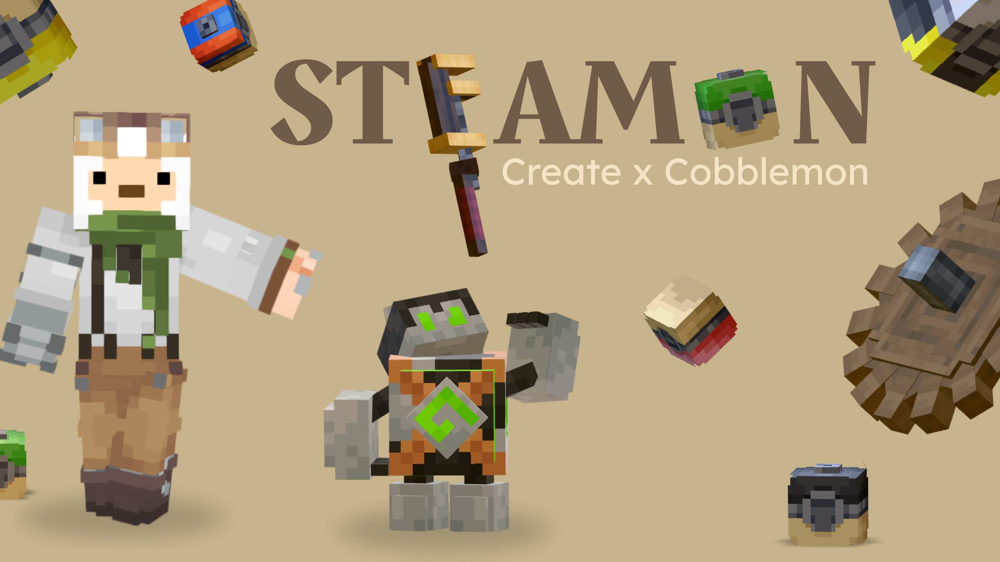

<div align="center">



# Steamon

**A Create × Cobblemon modpack for Minecraft 1.21.1 on NeoForge**

[](https://modrinth.com/project/steamon)
[](https://www.minecraft.net/)
[](https://neoforged.net/)
[](https://github.com/Gaspard4i/steamon-modpack/actions)
[](LICENSE)

</div>

---

## About

Steamon is a cozy **Create** × **Cobblemon** pack, made for calm and unhurried play. Catch and raise Pokémon, keep a small farm, cook real food, lay down some rails, and wander a bigger overworld. Nothing rushes you — play it solo for a long quiet run, or together with friends.

The pack ships as two separate variants on Modrinth:

- **Steamon Client** — for players. Performance mods (Sodium, Iris, FerriteCore), shader-ready, and all the Cobblemon UI helpers.
- **Steamon Server** — for hosts. Server-side performance mods (Lithium, ServerCore, Noisium) and curated Cobblemon datapacks: extended Pokédex, gym structures, Radiant variants.

Install the Client variant for singleplayer or to connect to a server. Install the Server variant when you host the server.

## Some of what's inside

Over 200 mods. A few that set the tone:

- [Create](https://modrinth.com/mod/create) & [Cobblemon](https://modrinth.com/mod/cobblemon) — the two pillars: contraptions and trains on one side, Pokémon to catch and train on the other.
- [Farmer's Delight](https://modrinth.com/mod/farmers-delight) — proper cooking, and a reason to keep a farm.
- [Terralith](https://modrinth.com/mod/terralith) — a prettier, bigger overworld to explore.
- [Relics](https://modrinth.com/mod/relics-mod) & [Artifacts](https://modrinth.com/mod/artifacts) — a light RPG layer with treasure worth hunting for.
- [Radical Cobblemon Trainers](https://modrinth.com/mod/rctmod) — wandering trainers to battle out in the world.
- [JEI](https://modrinth.com/mod/jei) — look up any recipe.
- [GraveStone](https://modrinth.com/mod/gravestone-mod) — get your stuff back when you die.
- [Lootr](https://modrinth.com/mod/lootr) — everyone gets their own chest loot, no fighting over it.
- [Open Parties and Claims](https://modrinth.com/mod/open-parties-and-claims) — claim your land and team up with friends.
- [Simple Voice Chat](https://modrinth.com/mod/simple-voice-chat) — talk to people near you.

The rest fills in the cozy details: more food, furniture, decoration, quality-of-life and performance. The full list lives in each version's file metadata.

## Technical details

- Minecraft **1.21.1**, mod loader **NeoForge 21.1.230**.
- Both variants are `.mrpack` files — installable via Modrinth App, Prism Launcher, ATLauncher, MultiMC, and any compatible launcher.
- Recommended: 8 GB RAM minimum for the client (12 GB with shaders enabled). 8 GB minimum for the server, 12 GB for 10+ concurrent players. Java 21 required.
- Built with [packwiz](https://packwiz.infra.link/); published automatically to Modrinth via GitHub Actions on each release tag.

## Install

### Client

1. Install the [Modrinth App](https://modrinth.com/app).
2. Browse Modpacks → search **Steamon** → click *Install* on the Client version.
3. Launch.

Works equally well with Prism Launcher, ATLauncher, MultiMC, or any launcher that accepts `.mrpack`.

### Server

See [`docs/INSTALL.md`](docs/INSTALL.md) for the full server setup.

## Repository layout

```
steamon-modpack/
├── .github/workflows/publish.yml   CI for Modrinth release on tag
├── .modrinth/                      Banner, icon, body.md (sources for the Modrinth listing)
├── client/                         packwiz pack: client variant
│   ├── pack.toml
│   ├── mods/*.pw.toml
│   ├── config/
│   ├── resourcepacks/
│   └── shaderpacks/
├── server/                         packwiz pack: server variant
│   ├── pack.toml
│   ├── mods/*.pw.toml
│   ├── config/
│   └── world/datapacks/
└── docs/
    ├── INSTALL.md
    ├── CONFIG_NOTES.md
    └── CHANGELOG.md
```

## Working on the pack

Source of truth: [packwiz](https://packwiz.infra.link/). Every mod is tracked in a TOML file under `client/mods/` or `server/mods/`.

```bash
# Add a mod
cd client          # or server
packwiz modrinth add <slug>
packwiz refresh

# Build a .mrpack locally
cd client
packwiz modrinth export
```

## Release

Tag the commit you want to publish:

```bash
git tag v1.0.0-client && git push origin v1.0.0-client
git tag v1.0.0-server && git push origin v1.0.0-server
```

The `Publish Modpack` GitHub Action builds the `.mrpack` with packwiz and uploads it to Modrinth.

## Contributing

I work on this alone, in my free time, and there are no sponsors — that's normal. If you have an idea or find something broken, open an [issue](https://github.com/Gaspard4i/steamon-modpack/issues) and I'll get to it when I can.

## Credits

Every mod, resource pack and shader in this pack is the work of its respective authors — please support them on their own Modrinth pages. Modpack curated by [Gaspard4i](https://github.com/Gaspard4i). Thanks to the Cobblemon, Create and Modrinth communities.

Steamon is not affiliated with Pokémon, Minecraft, Mojang, Microsoft, or the Cobblemon team.

## License

Pack contents are distributed under each mod author's individual license — consult their original Modrinth pages.

The configuration files, mod selection and build scripts in this repository are © 2026 Gaspard Catry, All Rights Reserved. Personal use and forking for personal play are explicitly permitted. See [`LICENSE`](LICENSE).
