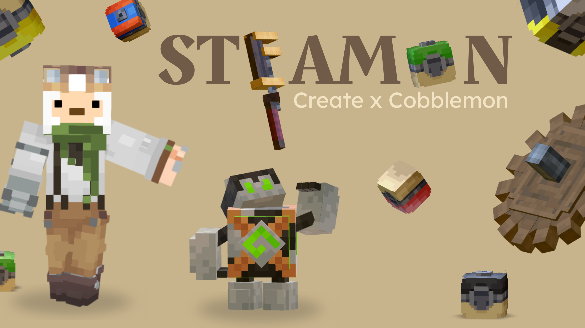

# Steamon

**A Create × Cobblemon modpack for Minecraft 1.21.1 on NeoForge**

---

Steamon mixes Create's machines and trains with Cobblemon's Pokémon, plus real cooking and farming from Farmer's Delight, on top of a bigger, prettier overworld to explore. It's built for slow, cozy play: catch and raise Pokémon, run a small farm, cook, build a railway, wander around. Solo or with friends, no rush.

The pack ships as two variants: **Client** to play, **Server** to host. Grab the Client one on Modrinth if you just want to play.
